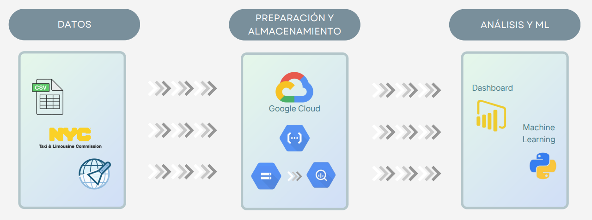
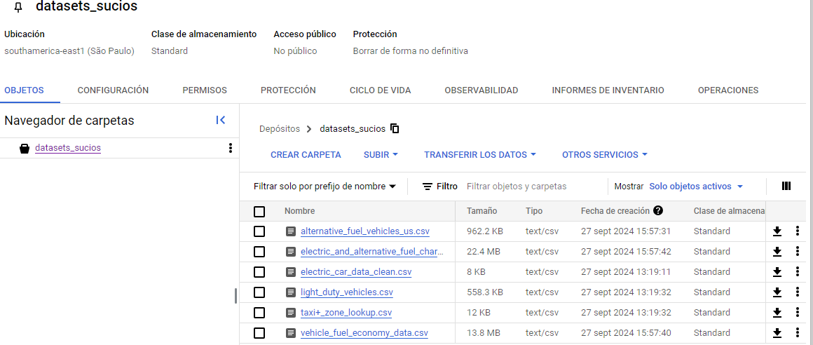
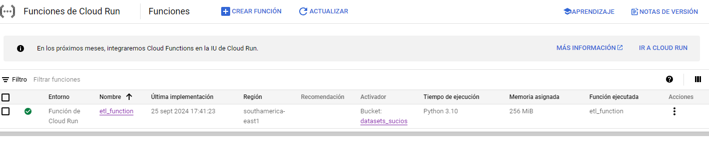

# Introducción

La Plataforma de Google Cloud (GCP) proporciona un conjunto completo y versátil de servicios en la nube, diseñados para empresas de cualquier tamaño. Al usar GCP, las organizaciones pueden aprovechar la infraestructura global de Google para alojar aplicaciones, guardar y examinar datos, y desarrollar soluciones avanzadas de inteligencia artificial y aprendizaje automático. Los servicios en la nube de Google Cloud permiten una expansión ilimitada, una sólida seguridad y una integración fluida con herramientas de desarrollo y gestión. Desde el lanzamiento de aplicaciones web hasta la creación de potentes flujos de datos, Google Cloud impulsa la innovación y mejora la eficiencia operativa, permitiendo a las empresas enfocarse en su crecimiento y en la creación de valor.

# Propuesta

# Justificación

La plataforma de Google Cloud ofrece una estructura flexible que se ajusta al crecimiento de cualquier empresa. Incluye Google Storage, un servicio ideal para crear un Data Lake capaz de almacenar enormes cantidades de información sin preocuparse por límites de capacidad. También cuenta con Google BigQuery, una herramienta de análisis de datos que permite realizar consultas de forma veloz y efectiva, crucial para manejar grandes volúmenes de información.
Google Cloud se destaca por la interconexión entre sus diversos servicios. Los procesos ETL/ELT pueden gestionarse eficazmente con herramientas como Google Cloud Dataflow, que facilita el procesamiento de datos tanto en tiempo real como por lotes. La versatilidad de BigQuery para trabajar con distintas herramientas de ETL/ELT asegura una transferencia y procesamiento fluido de los datos desde el data lake hacia BigQuery.

# Servicios utilizados

+ **Google Cloud Storage** es un servicio de almacenamiento de objetos totalmente administrado, seguro y altamente disponible que forma parte de Google Cloud Platform. Está diseñado para almacenar y acceder a datos de manera fácil y escalable, siendo ideal para una amplia variedad de necesidades de almacenamiento y casos de uso.

Diseño del Datalake que almacenerá datos en brutos y limpios:

+  **Cloud Functions** es una plataforma de computación sin servidor (serverless) ofrecida por Google Cloud Platform que permite a los desarrolladores ejecutar fragmentos de código en respuesta a eventos específicos, sin necesidad de gestionar ni escalar la infraestructura subyacente.

Implementación de las funciones que ejecutará los procesos de extracción, transformación y carga:

+ **Bigquery** es un servicio de almacenamiento y análisis de datos totalmente administrado y altamente escalable ofrecido por Google Cloud Platform. Está diseñado para procesar grandes conjuntos de datos de forma rápida y eficiente, permitiendo a los usuarios ejecutar consultas SQL para obtener información valiosa y tomar decisiones basadas en datos.

Implementación de un data warehouse para almacenar los datos:

.png)

