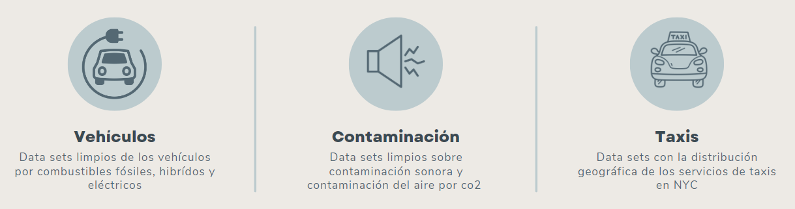

# Proyecto-Taxis-NYC

  

# Introducción 

En los últimos años, hemos sido testigos de un aumento significativo en la demanda de servicios de taxi, lo que ha tenido un impacto creciente en diversas dimensiones urbanas, especialmente en el medio ambiente. El sector del transporte se ha posicionado como el mayor emisor de CO2 en Estados Unidos, lo que subraya la urgencia de buscar soluciones sostenibles.
En respuesta a esta problemática, nuestro proyecto se propone explorar la viabilidad y el impacto de incorporar una flota de taxis eléctricos en Nueva York. 

## Tabla de contenidos
- [Introducción](#introducción)
- [¿Quiénes somos?](#quiénes-somos)
- [Objetivo General](#objetivo-general)
- [Objetivos específicos](#objetivos-específicos)
- [Conjunto de datos](#conjunto-de-datos)
- [Propuesta](#propuesta)
- [Stack tecnológico](#stack-tecnológico)
- [Cronograma de trabajo](#cronograma-de-trabajo)
- [Sprint 1](#sprint-1)
- [Sprint 2](#sprint-2)
- [Sprint 3](#sprint-3)

## ¿Quiénes somos?

Optima Data es una innovadora startup en el campo del análisis de datos, dedicada a transformar información compleja en insights accionables. Fundada recientemente por un equipo de expertos apasionados, nos estamos posicionando rápidamente como un socio confiable y dinámico para empresas que buscan aprovechar el poder de sus datos para impulsar el crecimiento y la innovación. Nuestra juventud como empresa es nuestra fortaleza, permitiéndonos ser ágiles, innovadores y estar a la vanguardia de las últimas tendencias y tecnologías en el análisis de datos.

## Objetivo General

Nuestro objetivo es doble: Por un lado, buscamos mitigar el impacto ambiental del transporte urbano, y por otro, mantener la eficiencia y calidad del servicio de taxis que caracteriza a la ciudad. 
Creemos firmemente que es posible contribuir a la sostenibilidad urbana sin descuidar las necesidades de movilidad de sus habitantes.
La importancia de este proyecto radica en su potencial para reducir significativamente las emisiones de CO2, mejorar la calidad del aire en la ciudad y establecer un precedente para otras grandes urbes a nivel mundial. La transición hacia vehículos eléctricos en el sector del taxi no solo representa una oportunidad para Nueva York de liderar en innovación urbana, sino que también marca un paso crucial hacia un futuro más sostenible y respetuoso con el medio ambiente.

## Objetivos específicos

  1) Analizar la correlación ente el volumen de viajes y los niveles de contaminación tanto de aire como sonora.
  2) Evaluar los beneficios de la electrificación de la flota en términos de reducción de emisiones y ruido
  3) Desarrollar un modelo predictivo para anticipar el impacto ambiental y económico en la transición 

## Conjunto de datos

Se creará una base de datos, alojada en la nube, que servirá de base para el análisis y posterior creación del modelo de machine learning.
Estos datos estarán divididos en tres grandes ejes: **Vehiculos**, **Contaminación** y **Servicio de Taxis**.

## Propuesta 

**Esquema de datos en la nube**: Un sistema organizado de almacenamiento y procesamiento de datos en la nube, donde se gestionará la información y se distribuirá a los componentes necesarios.

**Aplicativo de Machine Learning**: Una aplicación basada en Machine Learning que funcionará como 

**Dashboard interactivo**: Un tablero de control interactivo que presentará información relevante basada en los KPI definidos, promoviendo una toma de decisiones informada y efectiva.

## Stack tecnológico

**Herramientas de Organización y Comunicación**

+  **Google Meet** : Para videoconferencias y reuniones virtuales.

+  **Trello** : Para la gestión de proyectos y seguimiento de tareas.

**Herramientas para la elaboracion del ETL y EDA**
+   **Git**: Para el control de versiones y la colaboración en el desarrollo de código.

+ </a> **Python**: Utilizamos librerías específicas para como Numpy, Pandas, Matplotlib, entre otras.

+ **Platform Google Cloud Platform(GCP)** ofrece soluciones escalables y de alto rendimiento para manejar grandes volúmenes de datos y consultas complejas. Sus servicios se integran fluidamente, permitiendo la creación de pipelines de datos eficientes.
    *Servicios clave*:
    -**Cloud Storage**: Funciona como un Data Lake para almacenar datos en estado bruto de manera segura y eficiente.
  
    -**BigQuery**: Almacena y analiza grandes volúmenes de datos con procesamiento masivo y consultas SQL rápidas.
  
    -**Cloud Functions**: Automatiza tareas ETL, permitiendo la limpieza y transformación de datos en respuesta a eventos, asegurando un flujo continuo y actualizado.

**Herramientas para la Visualización de Datos**
+  **Power BI**: Para la creación de dashboards.
+  **Canva**: Para la creación de presentaciones dinámicas y comprensibles.

## Cronograma de trabajo

Este cronograma detalla un proyecto de tres semanas que abarca desde la comprensión inicial del proyecto hasta la presentación final, incluyendo fases críticas de análisis de datos, desarrollo de infraestructura y modelado de machine learning.

Nuestro grupo ha decidido adoptar la metodología **SCRUM** para mejorar la eficiencia y colaboración en la gestión de proyectos. 
SCRUM es un marco de trabajo ágil diseñado para ayudar a los equipos a desarrollar productos de manera más eficiente y adaptativa. Permite la organización en ciclos cortos y controlados llamados **Sprints**, donde los equipos se enfocan en cumplir con objetivos específicos. SCRUM promueve la autoorganización, la entrega continua de valor y la adaptabilidad ante cambios.

+ **Sprints**: Cada sprint durará 2 semanas. Al inicio de cada sprint, tendremos una reunión de planificación donde definiremos los objetivos.
+ **Daily Standup**: Cada día, realizaremos una reunión corta de 15 minutos para compartir el progreso, discutir bloqueos y coordinar el trabajo diario.
+ **Revisión de Sprint**: Al final de cada sprint, haremos una demo del trabajo completado y recogeremos feedback.
+ **Retrospectiva de Sprint**: Revisaremos lo que ha ido bien y lo que puede mejorar, ajustando nuestra forma de trabajar para el siguiente sprint.

### Sprint 1
Durante el primer sprint del proyecto, nos enfocamos en establecer una base sólida para el desarrollo del producto final. Utilizamos técnicas avanzadas de ciencia de datos y análisis para maximizar el valor entregado al cliente y su público objetivo. Se seleccionaron tecnologías adecuadas para manejar eficientemente los datos, se exploraron modelos de machine learning para predecir tarifas de taxi y se organizó una estructura de trabajo clara para asegurar un flujo de trabajo ordenado y eficaz. Este sprint sentó las bases para futuros desarrollos y refinamientos del producto.

  [Presentación Sprint 1](<https://www.canva.com/design/DAGQkFl6toc/9pJTaVY8Xym5KLHrF3gZKQ/view?utm_content=DAGQkFl6toc&utm_campaign=share_your_design&utm_medium=link&utm_source=shareyourdesignpanel#1>)

### Sprint 2
Esta semana, en el sprint 2, profundizamos en el análisis de los datos y comenzamos a trabajar con Google Cloud, lo que nos permitió establecer una infraestructura de datos robusta y avanzar con el modelado gracias a las integraciones de Cloud Functions, Cloud Storage y BigQuery. Utilizamos Cloud Storage para almacenar todos los datos necesarios para su posterior análisis, que fueron procesados mediante un pipeline ETL. Este proceso fue automatizado gracias al desarrollo de una Cloud Function que limpia y prepara los datos a medida que ingresan a los buckets. Finalmente, los datos se trasladan a BigQuery, donde pueden ser modelados de manera eficiente, aprovechando su formato tabular y el uso del lenguaje SQL.
